# Manual de Uso - Plataforma Meetix
*SDR com IA para WhatsApp*

---

Este manual detalha o funcionamento de todos os módulos e funcionalidades da plataforma Meetix, com base no mapeamento realizado no ambiente de produção.

## 1. Operação

A seção de Operação concentra as ferramentas diárias de vendas e gestão de contatos.

### 1.1. Dashboard
O painel inicial oferece uma visão geral do desempenho da operação de vendas.

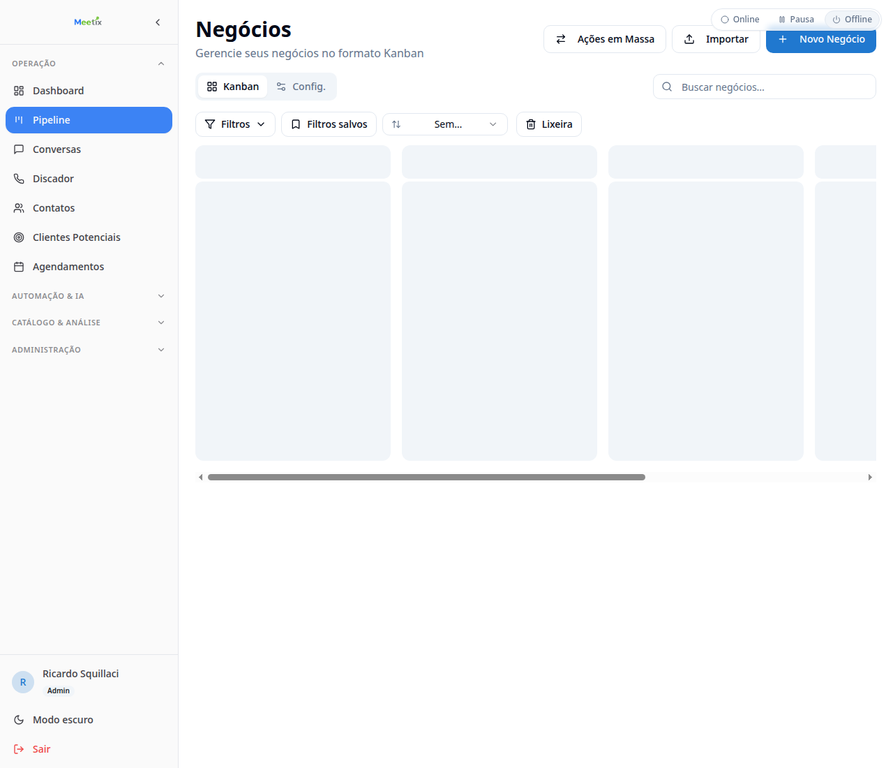 <!-- Usando a mesma estrutura de layout para ilustrar -->

**Funcionalidades:**
- **Resumo do Pipeline:** Métricas de Total de Leads, Em Qualificação, Agendados, Score Médio, Valor Pipeline e Conversão.
- **Funil de Vendas:** Visão quantitativa de leads por etapa (Novo, Qualificando, Agendado, Proposta, Nutrição, Perdido, Ganho).
- **Movimentação do Funil:** Gráfico temporal (Diário, Semanal, Mensal) da evolução dos leads.
- **Controles de Equipe:** Atribuição, Presença e Atividade dos Vendedores.
- **Progresso SPIN Selling:** Acompanhamento da metodologia SPIN (Situação, Problema, Implicação, Necessidade, Completo).

### 1.2. Pipeline
Gerenciamento visual dos negócios no formato Kanban.

**Funcionalidades:**
- **Visualização Kanban/Lista:** Arraste e solte cards entre as etapas.
- **Ações em Massa & Importação:** Manipulação de múltiplos negócios simultaneamente.
- **Filtros Avançados:** Busca por nome, status e filtros salvos.
- **Etapas Padrão:** Novo, Qualificando, Agendado, Proposta, Nutrição, Perdido, Ganho.

### 1.3. Conversas
Central de atendimento omnichannel para WhatsApp.

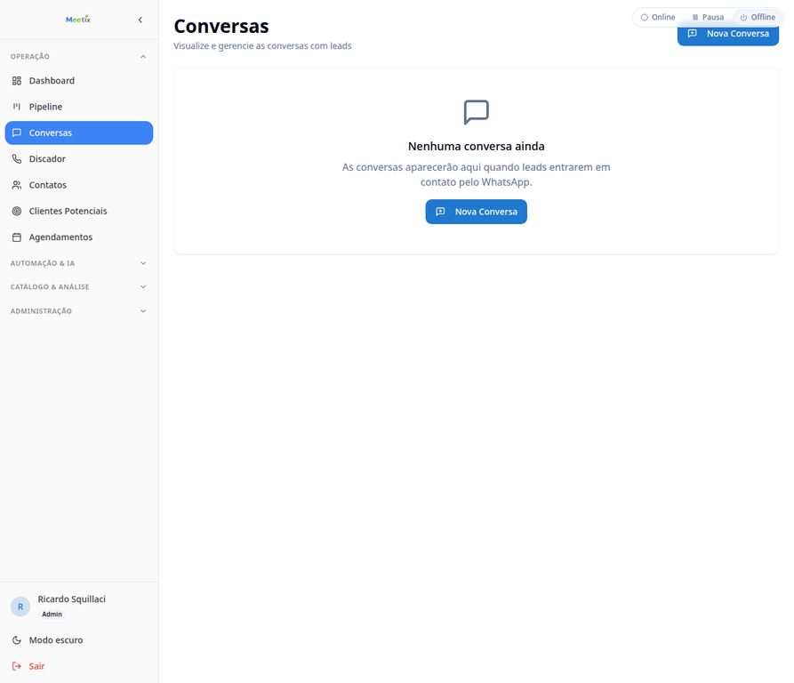

**Funcionalidades:**
- **Caixa de Entrada Unificada:** Visualize e gerencie conversas com leads.
- **Nova Conversa:** Inicie interações ativas com contatos.
- **Intervenção Humana:** Possibilidade de assumir o controle (pausando a IA) durante o atendimento.

### 1.4. Discador
Ferramenta integrada de telefonia VoIP.

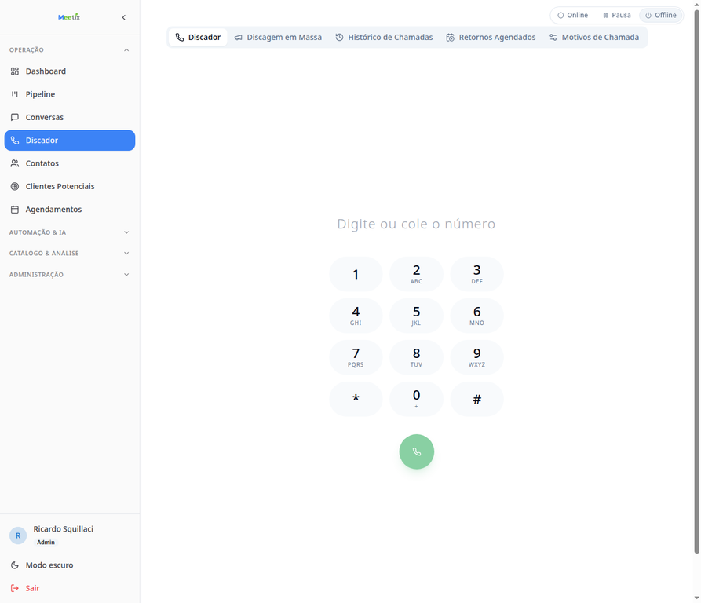

**Funcionalidades:**
- **Teclado Numérico (Softphone):** Realize chamadas diretamente do navegador.
- **Discagem em Massa:** Campanhas de chamadas ativas.
- **Histórico e Retornos:** Registro de chamadas e agendamento de callbacks.
- **Tabulação:** Classificação de chamadas por motivos pré-definidos.

### 1.5. Contatos
Gestão do CRM (Customer Relationship Management).

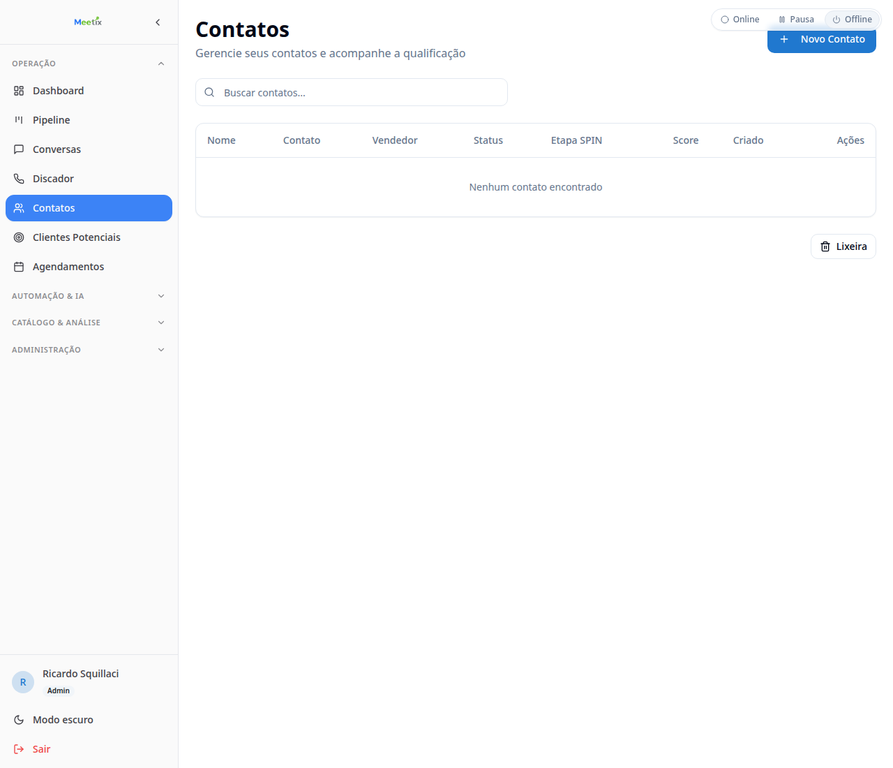

**Funcionalidades:**
- **Listagem de Leads:** Tabela com Nome, Contato, Vendedor, Status, Etapa SPIN e Score.
- **Criação e Edição:** Adição manual de novos contatos.
- **Lixeira:** Recuperação de contatos excluídos.

### 1.6. Clientes Potenciais (Prospects)
Módulo de mineração (Outbound).

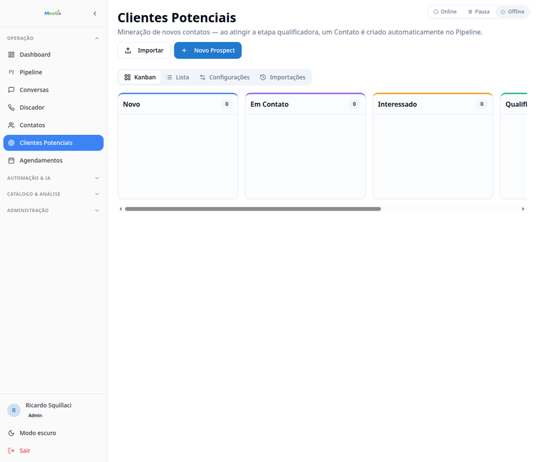

**Funcionalidades:**
- **Qualificação Inicial:** Etapas de Novo, Em Contato, Interessado, Qualificado e Descartado.
- **Transição Automática:** Ao atingir a etapa "Qualificado", o prospect é convertido automaticamente em um Contato no Pipeline.

### 1.7. Agendamentos
Gestão de reuniões e calendário.

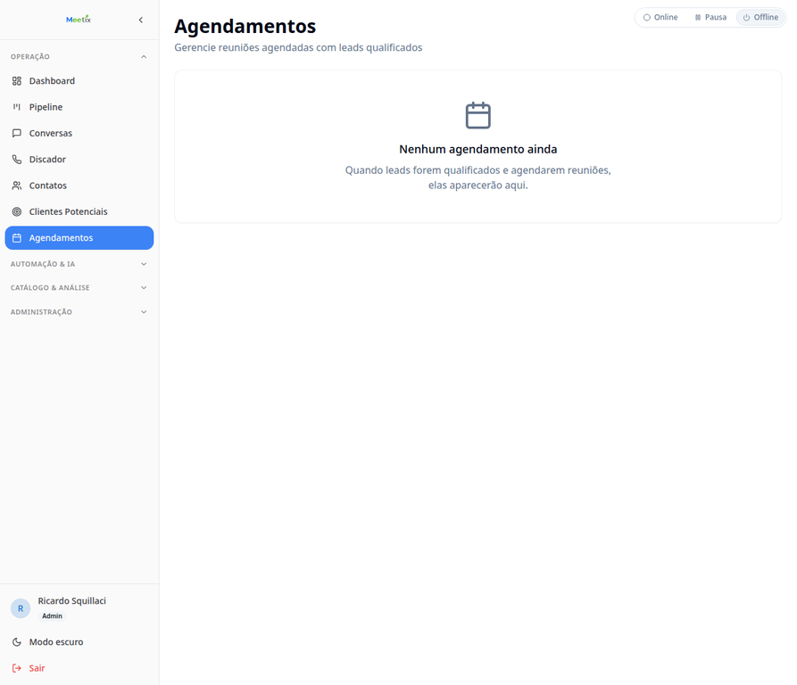

**Funcionalidades:**
- **Calendário Integrado:** Visualização de reuniões marcadas com leads qualificados.

---

## 2. Automação & IA

Configuração do "cérebro" da operação e fluxos automáticos.

### 2.1. Fluxos / Chatbot
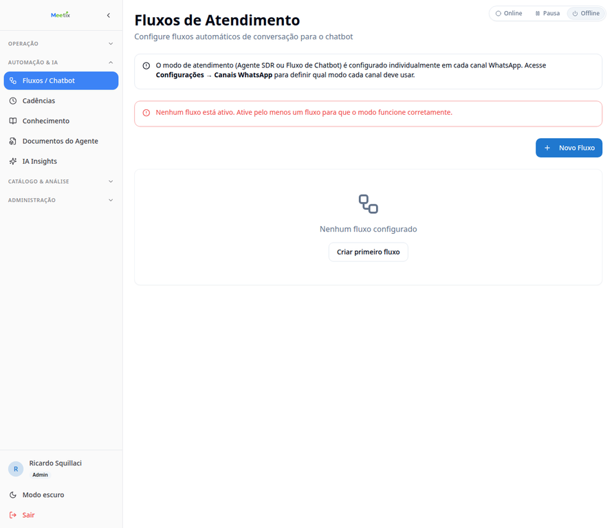
- Criação de fluxos automáticos de conversação (árvores de decisão).
- Definição do modo de atendimento por canal (Agente SDR ou Fluxo).

### 2.2. Cadências
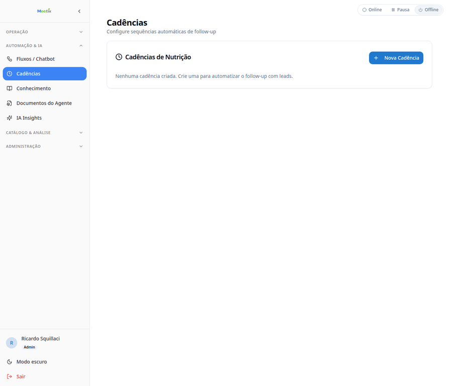
- Sequências automáticas de follow-up (Nutrição).

### 2.3. Conhecimento (Base de Conhecimento)
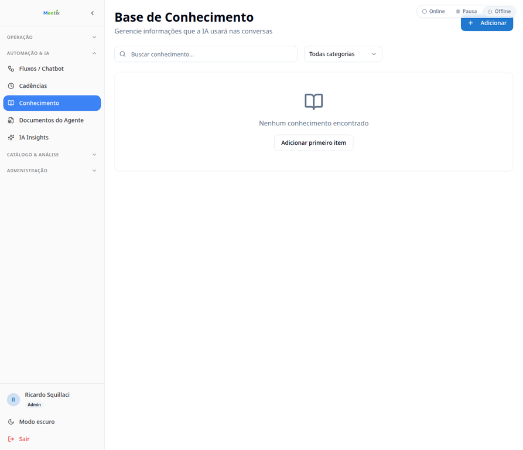
- Inserção de informações (textos, FAQs) que a IA usará como contexto para responder perguntas dos leads.

### 2.4. Documentos do Agente
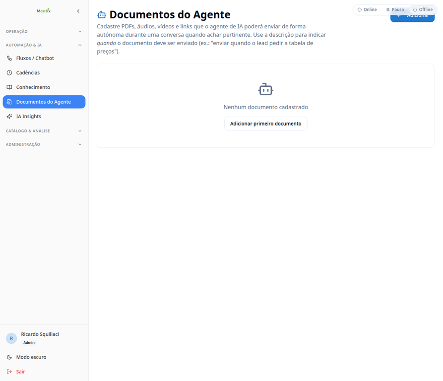
- Upload de PDFs, áudios, vídeos e links.
- A IA pode enviar esses materiais de forma autônoma durante a conversa, baseada em gatilhos configurados na descrição (ex: "enviar quando pedir tabela de preços").

### 2.5. IA Insights (Analista IA)
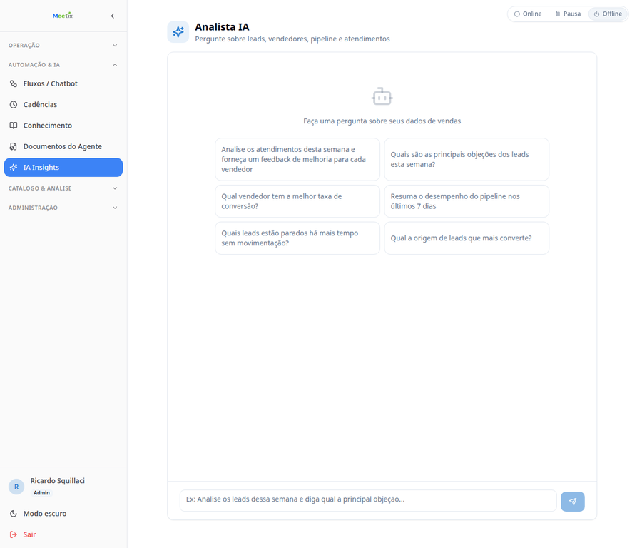
- Interface de chat para consultar dados da operação em linguagem natural.
- Exemplos de prompts nativos: "Analise os atendimentos e forneça feedback", "Principais objeções", "Melhor taxa de conversão".

---

## 3. Catálogo & Análise

### 3.1. Produtos
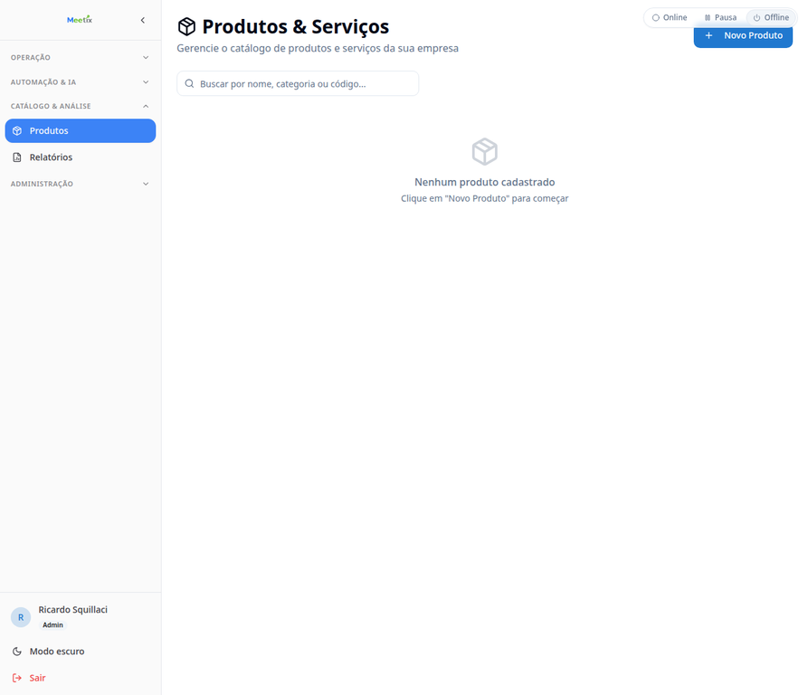
- Cadastro do portfólio de produtos/serviços para associação aos negócios.

### 3.2. Relatórios
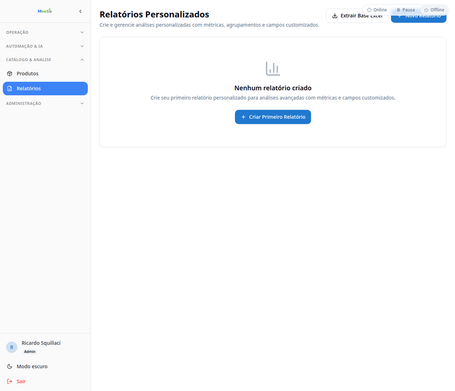
- Criação de análises personalizadas com métricas e agrupamentos customizados.
- Exportação de base para Excel.

---

## 4. Administração

Configurações sistêmicas e estruturais da plataforma.

### 4.1. Equipe
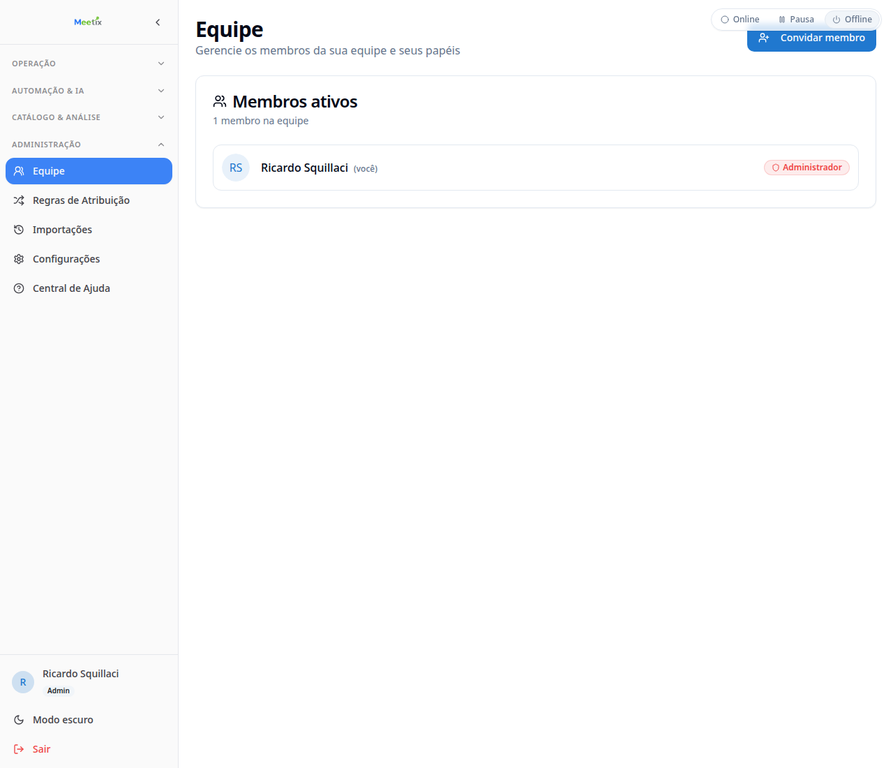
- Convite e gestão de membros (Administradores, Vendedores).

### 4.2. Regras de Atribuição
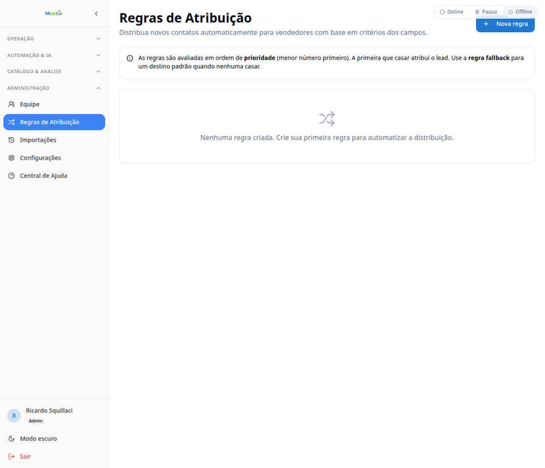
- Roteamento de leads (Lead Routing). Distribuição automática para vendedores baseada em critérios e prioridades (com regra de fallback).

### 4.3. Importações
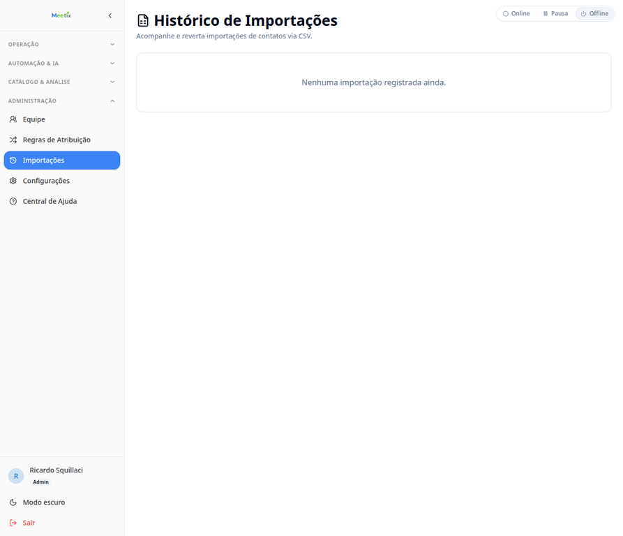
- Histórico e reversão de importações em massa via CSV.

### 4.4. Configurações
Central de setup dividida em três pilares principais:

**Inteligência Artificial:**
- **Agente IA:** Nome da empresa, segmento, cor, nome do agente, tom de voz e persona. Gerenciamento de Canais WhatsApp (Meta API Oficial ou Z-API).
- **Provedor IA:** Chaves de API (OpenAI, Anthropic) e seleção de modelos.
- **Metodologia:** Critérios de qualificação utilizados pela IA.

**Operação:**
- **Agendamento:** Integração com Cal.com / Calendly e definição de horário comercial.
- **Webhooks:** Recebimento de leads via formulários externos.
- **Disparo Externo:** Templates para campanhas.
- **Clientes Potenciais:** Mapeamento de campos de prospects para o Pipeline.

**Conta & Administração:**
- Perfil, Backup & API (Tokens do tenant) e encerramento de conta.

### 4.5. Central de Ajuda
- Documentação técnica completa integrada à plataforma para consulta rápida.

---
*Documento gerado com base no mapeamento da plataforma Meetix em 02 de Julho de 2026.*
